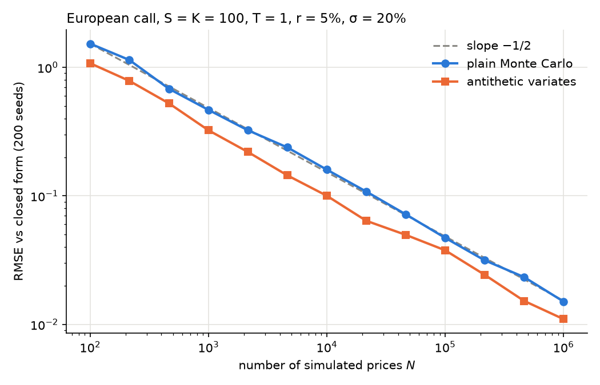

# option-pricer

European option pricing under the Black-Scholes model, implemented twice and
checked against itself: a closed-form pricer and a Monte Carlo pricer with
variance reduction. Written in Python with NumPy and SciPy, fully tested with
pytest.



The Monte Carlo error decays like $1/\sqrt{N}$ (slope $-1/2$ on the log-log
plot). Antithetic variates keep the same rate with a smaller constant: for an
at-the-money call, they cut the variance by a factor of about 2 at equal cost.

## Features

- **Closed form** (`bs_price`, `bs_delta`): Black-Scholes prices and delta for
  European calls and puts, with input validation.
- **Monte Carlo** (`mc_price`): exact sampling of the terminal price under the
  risk-neutral measure, so the only error is statistical. Returns the estimate
  together with its standard error and a 95% confidence interval.
- **Antithetic variates**: each normal draw $Z$ is paired with $-Z$. The
  standard error is computed on the pair averages, which are i.i.d.
- **Reproducibility**: every Monte Carlo run accepts a `seed`.

## Model

Under the risk-neutral measure, the underlying follows a geometric Brownian
motion, so that

$$
S_T = S_0 \exp\left( \left(r - \tfrac{1}{2}\sigma^2\right) T + \sigma \sqrt{T} Z \right), \qquad Z \sim \mathcal{N}(0, 1).
$$

The price of a European option is the discounted expected payoff,
$V_0 = e^{-rT} \mathbb{E}[\text{payoff}(S_T)]$. Conventions: $T$ in years, $r$
and $\sigma$ annualised, continuous compounding, no dividends.

## Quick start

```bash
git clone https://github.com/luka-nedeljkovic/option-pricer.git
cd option-pricer
python -m venv .venv
source .venv/bin/activate        # Windows: .venv\Scripts\Activate.ps1
pip install -r requirements.txt
```

```python
from option_pricer.black_scholes import bs_price, bs_delta
from option_pricer.monte_carlo import mc_price

bs_price(100, 100, 1.0, 0.05, 0.2)      # 10.4506
bs_delta(100, 100, 1.0, 0.05, 0.2)      # 0.6368

result = mc_price(100, 100, 1.0, 0.05, 0.2, n_paths=100_000, antithetic=True, seed=42)
result.price                    # 10.4673
result.std_error                # 0.0331
result.confidence_interval()    # (10.4025, 10.5321)
```

## Tests

```bash
pytest
```

The test suite (29 tests) checks:

- reference prices (Hull's textbook case) and put-call parity on a grid of
  spots and maturities;
- the analytical delta against a central finite difference;
- Monte Carlo prices within four standard errors of the closed form;
- the empirical coverage of the 95% confidence interval over 1,000
  independent runs;
- the $1/\sqrt{N}$ scaling of the standard error and the variance reduction
  from antithetic variates.

To regenerate the convergence plot:

```bash
python examples/convergence.py
```

## Project structure

```
src/option_pricer/
    black_scholes.py    closed-form prices and delta
    monte_carlo.py      Monte Carlo pricer with antithetic variates
tests/                  pytest suite
examples/
    convergence.py      generates docs/mc_convergence.png
```

## Roadmap

- Finite-difference solver for the Black-Scholes PDE (Crank-Nicolson scheme)
- Full set of Greeks (gamma, vega, theta, rho)
- Implied volatility by Newton-Raphson
- Heston stochastic volatility model

## License

MIT